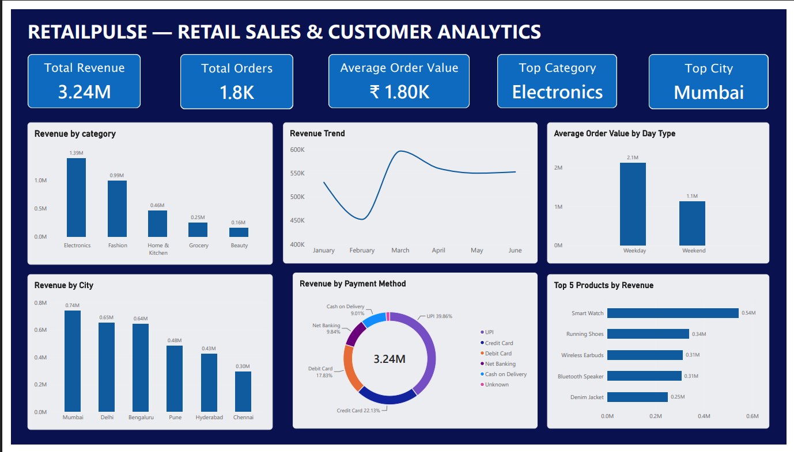

# RetailPulse — Retail Sales & Customer Analytics

RetailPulse is a retail sales analytics project focused on understanding sales performance, customer behavior, product performance, and data quality.

The project follows a practical end-to-end data analysis workflow:

**Raw Data → Data Cleaning → Validation → Exploratory Analysis → Business Insights → Interactive Dashboard**

---

## Interactive Dashboard

### RetailPulse Power BI Dashboard



The interactive Power BI dashboard provides a visual overview of the key business metrics and analytical findings.

### Dashboard Includes

- **Total Revenue** — ₹3.24M
- **Total Orders** — 1.8K
- **Average Order Value** — ~₹1,801
- **Top Category** — Electronics
- **Top City** — Mumbai
- **Revenue Trend**
- **Revenue by Category**
- **Revenue by City**
- **Revenue by Payment Method**
- **Average Order Value by Day Type**
- **Top 5 Products by Revenue**

The Power BI dashboard is available in both `.pbix` and PDF formats in the `visuals/` folder.

---

## Project Overview

The dataset contains retail order-level information including customer details, product information, pricing, discounts, payment methods, ratings, and order dates.

The analysis focuses on questions such as:

- How much revenue is being generated?
- Which product categories contribute the most revenue?
- Which cities generate the most sales?
- Which products are top performers?
- How does order value differ between weekdays and weekends?
- Which payment methods are most frequently used?
- Are there meaningful relationships between discounts, quantity, and sales?

---

## Data Cleaning

The original dataset contained several data quality issues that were addressed before analysis.

Key cleaning steps included:

- Removed **25 duplicate records**
- Handled missing quantities using product-level median values
- Imputed missing unit prices using product-level medians
- Replaced missing discounts with `0`
- Replaced missing payment methods with `Unknown`
- Imputed missing customer ages using the median
- Retained missing ratings rather than artificially imputing them
- Identified and replaced **4 extreme unit-price values**
- Identified and corrected **4 extreme quantity values (999)**
- Created additional analytical columns including `revenue` and `day_type`

After cleaning, the dataset contained **1,800 records and 13 columns**.

---

## Key Findings

### Revenue

Total revenue generated was approximately **₹3.24 million**.

### Category Performance

**Electronics** generated the highest revenue at approximately **₹1.39 million**.

### City Performance

**Mumbai** generated the highest revenue at approximately **₹741.5K**.

### Product Performance

**Smart Watch** was the highest-revenue product at approximately **₹542.9K**.

### Customer Spending

Average Order Value was higher on weekends than weekdays:

- Weekday AOV: **₹1,676.23**
- Weekend AOV: **₹2,112.71**

### Payment Behavior

**UPI** was the most frequently used payment method.

### Discount & Quantity

The relationship between discount and quantity was extremely weak, with a correlation of approximately **0.0028**.

This suggests that, within this dataset, higher discounts were not strongly associated with higher quantities purchased.

---

## Tools Used

- Python
- Pandas
- NumPy
- Matplotlib
- Jupyter Notebook
- Power BI

---

## Project Structure

```text
retailpulse-retail-analytics/
├── README.md
├── requirements.txt
├── data/
│   └── retailpulse_orders_cleaned.csv
├── notebooks/
│   └── RetailPulse_Analysis.ipynb
├── reports/
│   ├── Data_Cleaning_Notes.pdf
│   └── Summary_of_Findings.pdf
└── visuals/
    ├── retailpulse_dashboard.pbix
    ├── retailpulse_dashboard.pdf
    └── retailpulse_dashboard.png
